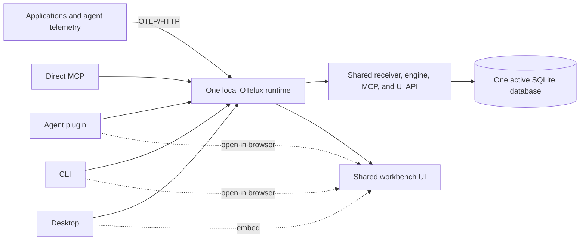

# OTelux

OTelux is a local-first OpenTelemetry workbench for developers and coding agents. It receives traces, logs, and metrics, stores them on the user's machine, renders them in a shared visual workbench, and exposes evidence through MCP tools.

The target product is one per-user OTelux runtime presented through four install and interaction forms: agent plugin, direct MCP integration, CLI, and Desktop. They share one receiver, engine, active SQLite database, query contract, and browser-safe UI. Installing another form later connects it to the same local data instead of creating another backend.

The browser workbench is not a separate product. The plugin and CLI open the shared workbench from the local runtime in a browser; Desktop embeds the same `@otelux/ui` application in its native shell.

## Product Ecosystem

| Form | End-user experience | Availability |
|---|---|---|
| Agent plugin | Install in Claude or Codex to get OTelux skills, MCP tools, telemetry setup workflows, and a dashboard command. | Desktop-companion `0.1.4` exists; self-contained runtime is planned. |
| Direct MCP | Register OTelux as an MCP server without plugin skills or Electron. | Planned standalone packaging; current bridge connects to Desktop. |
| CLI | Run OTelux headlessly, inspect health and endpoints, manage settings, and open the browser workbench. | Planned. |
| Desktop app | Use the native traces, logs, and metrics workbench with receiver and retention settings. | Pre-release app embeds the shared runtime package; daemon-client conversion is planned. |



The runtime is the only process that opens SQLite, applies migrations and retention, and binds OTLP/MCP listeners. See [docs/arch.md](docs/arch.md) for lifecycle, migration, package boundaries, end-user scenarios, and the distinction between the current and target implementations.

## Docs

- [docs/spec.md](docs/spec.md) — product, architecture, current state, package boundaries, and UX requirements.
- [docs/plan.md](docs/plan.md) — work ahead only.
- [docs/release-sprint.md](docs/release-sprint.md) — finite public-release execution plan, launch gates, and evidence.
- [docs/getting-started.md](docs/getting-started.md) — current source setup, first telemetry, troubleshooting, and removal.
- [docs/privacy.md](docs/privacy.md) — local data handling and safe telemetry sharing.
- [docs/security-model.md](docs/security-model.md) — trust boundaries, current safeguards, and release blockers.
- [docs/arch.md](docs/arch.md) — the four product forms, shared local runtime, UI delivery, data ownership, and end-user scenarios.
- [docs/proposal.md](docs/proposal.md) — project rationale, audience, and product direction.
- [docs/test.md](docs/test.md) — manual desktop verification plan.
- [design/README.md](design/README.md) — UI mockup philosophy and design notes.

## Community

- [CONTRIBUTING.md](CONTRIBUTING.md) — development workflow and pull request expectations.
- [SUPPORT.md](SUPPORT.md) — support scope and telemetry privacy guidance.
- [SECURITY.md](SECURITY.md) — vulnerability reporting policy and current launch gate.
- [CODE_OF_CONDUCT.md](CODE_OF_CONDUCT.md) — community standards and confidential reporting.

Never post credentials or raw production telemetry in a public issue. Use synthetic fixtures or redact prompts, SQL, URLs, headers, identifiers, paths, and customer data.

## Repository Layout

```text
otelux/
  apps/
    desktop/            # Electron desktop workbench
  packages/
    types/              # Shared telemetry types
    protocol/           # DataSource interface and query/result shapes
    engine/             # Ingest, query, layout, subscriptions, storage boundary
    engine-node/        # Node local-storage adapter
    local-runtime/      # Storage, engine, OTLP, MCP, settings, lifecycle
    receiver/           # OTLP receiver
    mcp-server/         # Read-only MCP JSON-RPC tools
    adapter-direct/     # In-process DataSource adapter
    ui/                 # React workbench and primitives
  plugins/
    otelux/             # Shared Claude/Codex skills + MCP launcher/bridge
  fixtures/             # OTLP JSON fixtures for traces, logs, and metrics
  docs/                 # Canonical project docs
  design/               # Single-file UI mockup and notes
```

## Develop

Requires Node 22.12+ and npm 10.9.x.

```bash
npm install
npm run lint
npm run typecheck
npm run test
npm run build
```

Launch the desktop app in development:

```bash
npm run -w @otelux/desktop dev
```

Build the desktop app:

```bash
npm run -w @otelux/desktop build
```

Test the current `0.1.4` local agent plugin after starting the desktop app:

```bash
# Codex
codex plugin marketplace add .
codex plugin add otelux@otelux-plugins

# Claude Code
claude plugin marketplace add /absolute/path/to/otelux
claude plugin install otelux@otelux-plugins
```

Both hosts currently load the same four skills and connect to the desktop's authenticated, read-only MCP listener. The target plugin starts or discovers the shared local runtime and no longer requires Desktop. See [plugins/otelux/README.md](plugins/otelux/README.md) for current usage and [docs/arch.md](docs/arch.md#current-implementation) for the migration plan.

Exercise the current Linux packaging target while release work is in progress:

```bash
npm run -w @otelux/desktop package
```

## Current Status

Pre-release. `@otelux/local-runtime` now owns storage, engine, OTLP, MCP, settings, lifecycle, canonical data-home migration, and nonce-protected runtime state. Desktop still embeds it in Electron and the `0.1.4` plugin remains a Desktop companion. The standalone daemon, CLI, direct MCP package, and runtime-served workbench are planned. Start with [docs/getting-started.md](docs/getting-started.md). See the specification's [Current Baseline](docs/spec.md#current-baseline) for implemented capabilities, [docs/arch.md](docs/arch.md#current-implementation) for the architecture transition, [docs/plan.md](docs/plan.md) for future work, and [docs/release-sprint.md](docs/release-sprint.md) for temporary `v0.1.0` launch execution.

## License

[MIT](LICENSE).
