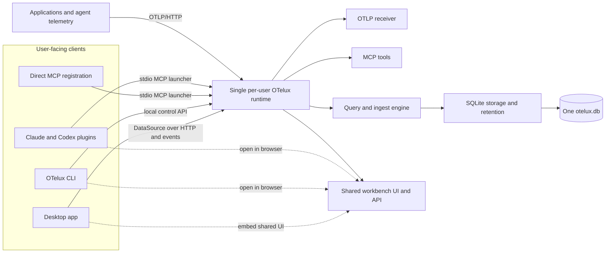
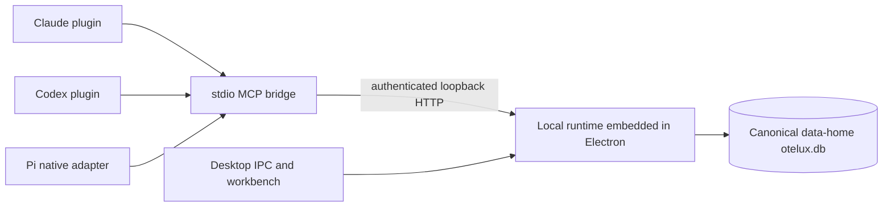

# OTelux Architecture And Ecosystem

Updated: 2026-07-16

OTelux is one local OpenTelemetry runtime presented through four user-facing forms: agent plugin, direct MCP integration, CLI, and Desktop. They reuse the same receiver, engine, storage, query contracts, and UI rather than becoming separate observability products.

The browser workbench is not a fifth product form. It is a delivery mode for the shared `@otelux/ui`: the agent plugin and CLI can open it from the local runtime, while Desktop embeds the same workbench in its native shell.

The core invariant is:

> One user, one OTelux runtime, one active database, and many clients.

This document describes the target architecture. The [Current Implementation](#current-implementation) section distinguishes what is shipped today from what still needs to be built.

The detailed communication contract is [protocol.md](protocol.md). SQLite schema and query invariants are [storage.md](storage.md). Those documents are normative for daemon and storage work; this document owns the system shape.

## Product Forms

| Form | User experience | What it installs or starts | Status |
|---|---|---|---|
| Agent plugin | Install OTelux in Claude, Codex, or Pi, use analysis skills and MCP tools, configure telemetry, and open the visual workbench. | Shared skills, host manifests, a small stdio MCP launcher, and a thin native Pi adapter over that launcher. | Desktop-companion version shipped; self-contained runtime target. |
| Direct MCP | Register OTelux as an MCP server without installing agent skills or a desktop UI. | The same stdio MCP launcher used by the plugins. It ensures and connects to the local runtime. | Target packaging; the current bridge requires Desktop. |
| CLI | Run, inspect, configure, stop, and open OTelux from a terminal or headless environment. | The local runtime plus commands such as `otelux serve`, `otelux status`, and `otelux open`. | Planned. |
| Desktop app | Install a native workbench with receiver and storage settings. | Electron UI plus the shared local runtime. Desktop is a client of that runtime, not a second backend owner. | Runtime package embedded; standalone-daemon connection planned. |

These forms are distribution and entry-point choices. They do not create separate telemetry stores. Browser delivery is an implementation detail of the plugin and CLI experiences, not a separately installed or published artifact.

## End-User Scenarios

| Scenario | Result |
|---|---|
| A Claude or Codex user installs the plugin. | On first activation, the MCP launcher starts or discovers the local runtime. Skills and tools use its store, and `otel_open_dashboard` opens the browser workbench. Desktop is optional. |
| A user asks the plugin to configure agent telemetry. | After showing the exact change and receiving approval, the setup workflow points Claude or Codex at the local OTLP/HTTP endpoint. A restart is required for the agent process to inherit the new configuration. |
| A developer asks the plugin to instrument an application. | The workflow detects the stack, configures its OpenTelemetry SDK or Collector for OTLP/HTTP, and verifies that telemetry reaches OTelux. |
| A user installs only Desktop. | Desktop ensures the local runtime exists and connects to it. The same receiver, database, settings, and UI behavior are available without an agent plugin. |
| A plugin user installs Desktop later. | Desktop discovers the existing runtime and immediately shows the telemetry already collected by the plugin. No second database is created. |
| A Desktop user installs a plugin later. | The plugin connects to the existing runtime and exposes skills and MCP analysis over the telemetry already visible in Desktop. |
| A user installs OTelux in Claude, Codex, and Pi. | All launchers reuse one runtime, receiver, and database. Pi registers the bridge tools natively; concurrent agent sessions do not bind duplicate ports. |
| A user wants only MCP. | They register the standalone OTelux stdio launcher. It exposes the same tools and store without installing plugin skills or Electron. |
| A headless user installs the CLI. | `otelux serve` runs the receiver, storage, MCP service, and browser assets without a desktop environment. |

## Local Architecture



### Communication Boundaries

OTelux uses one protocol per boundary:

- OTLP/HTTP protobuf or JSON for external telemetry ingest;
- direct typed calls between runtime, engine, and storage in one process;
- MCP JSON-RPC over stdio/Streamable HTTP for agent tools only;
- JSON-RPC 2.0 over loopback HTTP for the planned Desktop/CLI/browser Runtime API;
- Server-Sent Events for one-way live invalidations;
- Electron IPC only as a temporary Desktop bridge while the runtime remains embedded.

MCP is not reused as the workbench API, and WebSocket/internal gRPC are not introduced without a demonstrated bidirectional-streaming requirement. See [protocol.md](protocol.md) for method families, wire encodings, authentication, errors, and version negotiation.

### Runtime Ownership

The local runtime is a long-lived, single-instance process for the current OS user. It alone owns:

- the active SQLite connection and schema migrations;
- OTLP/HTTP listeners for traces, logs, and metrics;
- the MCP engine and authenticated loopback endpoint;
- retention, clear-data, sample-data, and settings mutations;
- query APIs and live change subscriptions;
- shared workbench assets and its local HTTP API.

Desktop and plugin processes must not independently open the same database. SQLite WAL supports multiple processes, but multiple backend owners would introduce migration races, duplicate retention jobs, conflicting clear operations, stale caches, and listener port conflicts.

### Startup And Discovery

Every entry point uses the same `ensure runtime` operation:

1. Resolve the canonical per-user OTelux data directory.
2. Read and validate `runtime.json`.
3. Check the recorded PID and protocol/runtime versions.
4. If no owner is alive, atomically claim `runtime.lock` with a random ownership nonce and launch one.
5. Publish the PID, listener statuses, versions, token location, and active database path atomically.
6. Connect as a client.

This handles Desktop and several agent sessions starting concurrently. An occupied stable OTLP port is an actionable error; the runtime must not silently move it because exporters are configured with that endpoint. The workbench/API port may fall back to another loopback port because clients discover its current URL through runtime state.

Closing Desktop disconnects that client but does not stop ingest or agent access. The CLI owns explicit lifecycle commands, and installers may register normal OS startup behavior later without changing runtime ownership.

### Default Endpoints

| Endpoint | Default | Stability |
|---|---:|---|
| OTLP/HTTP | `127.0.0.1:4319` | Stable by default because exporters persist this address. Supports `/v1/traces`, `/v1/logs`, and `/v1/metrics`. |
| MCP HTTP/internal | `127.0.0.1:4320` | Discoverable and token-authenticated. Plugins normally connect through stdio rather than exposing the token to the model. |
| Workbench/API | `127.0.0.1:4321` | Preferred port; may move when occupied because `otelux open` and the plugin return the effective URL. |

All listeners bind to loopback by default. LAN exposure requires a future explicit setting with a reviewed authentication and threat model.

## Shared Implementation

| Concern | Owning package or app | Reused by |
|---|---|---|
| Canonical OpenTelemetry types | `@otelux/types` | Every ingest, storage, query, MCP, and UI surface. |
| Query and result contract | `@otelux/protocol` | Desktop, runtime-served workbench, adapters, and tests. |
| Ingest, queries, subscriptions | `@otelux/engine` | Local runtime. |
| Durable local storage | `@otelux/engine-node` | Local runtime only; clients never open SQLite directly. |
| OTLP/HTTP receiver | `@otelux/receiver` | Local runtime and supported server compositions. |
| Agent analysis tools | `@otelux/mcp-server` | Plugin, direct MCP, CLI diagnostics, and Desktop. |
| Browser-safe workbench | `@otelux/ui` | Runtime-served browser mode and Desktop renderer. |
| In-process adapter | `@otelux/adapter-direct` | Tests and deliberately embedded hosts. |
| HTTP/event adapter | Planned `@otelux/adapter-http` | Runtime-served workbench and Desktop client. |
| Runtime composition | `@otelux/local-runtime` | Embedded by Desktop now; CLI, plugin launcher, and direct MCP after daemon lifecycle lands. |
| Analysis workflows | `plugins/otelux/skills` | Claude and Codex plugin manifests plus the Pi package adapter. |

The `DataSource` interface remains the load-bearing UI boundary. The workbench asks for traces, logs, metrics, details, and change events through that contract; host adapters decide whether those calls are direct, Electron IPC, or local HTTP/event traffic.

The runtime-served workbench and Desktop renderer use the same compiled React application. Desktop may add native window, menu, and update integration, but it must not fork observability views or query behavior.

Storage must obey the statement-count, identity, pagination, and bounded-payload rules in [storage.md](storage.md). In particular, span identity is `(traceId, spanId)`, list predicates must apply before count/pagination, and metric metadata queries must not load each instrument's full point history.

## Local Data And Migration

The runtime uses a product-level data directory independent of plugin caches and application installation paths:

| Platform | Default data directory |
|---|---|
| Linux | `$XDG_DATA_HOME/otelux`, or `~/.local/share/otelux` when unset. |
| macOS | `~/Library/Application Support/OTelux`. |
| Windows | `%LOCALAPPDATA%\OTelux`. |

It contains the default `otelux.db`, `settings.json`, owner-only `mcp-token`, and the transient owner-only `runtime.json` / `runtime.lock` files while the runtime is active. `OTELUX_DATA_DIR` overrides the location for development and tests. A user-configured absolute database path remains supported, but only the runtime resolves and opens it.

The shared-runtime release must migrate existing Desktop users safely:

1. Acquire the exclusive runtime lock before inspecting legacy state.
2. If no canonical database exists, atomically copy the legacy Electron database, sidecars, settings, and token.
3. Preserve a configured custom database path rather than relocating that database.
4. Reuse the existing schema migration and corruption-quarantine behavior.
5. Never silently merge two populated databases. Preserve both and require an explicit import decision.

Migration uses a resumable marker and intentionally leaves the legacy source files in place. This favors recovery over reclaiming disk automatically; users can remove the legacy Electron directory after confirming the canonical store is healthy.

Plugin-first users need no migration when they later install Desktop; Desktop simply connects to the already populated runtime.

## Agent Plugin And MCP

The Claude, Codex, and Pi integrations remain thin host-specific wrappers over one plugin payload:

```text
plugins/otelux/
├── .claude-plugin/plugin.json
├── .codex-plugin/plugin.json
├── package.json
├── extensions/otelux.ts
├── .mcp.json
├── .mcp.codex.json
├── bin/otelux-mcp-launcher.mjs
└── skills/
    ├── investigate-incident/
    ├── analyze-trace/
    ├── service-health/
    ├── open-dashboard/
    ├── setup-otelux/
    └── configure-telemetry/
```

The launcher is a per-session stdio MCP process, not the telemetry backend. It ensures the shared runtime is available and proxies MCP messages to it. This keeps agent host integration simple while preventing each Claude, Codex, or Pi session from binding OTLP and browser ports. Pi's extension adapts MCP schemas and results into Pi's native tool API while leaving query behavior in the MCP server.

Plugin packages must include prebuilt runtime and UI assets. Codex npm plugin installation does not run lifecycle scripts, so installation cannot depend on `postinstall`, compilation, or an `npx` download at startup.

Configuration workflows must show proposed edits and receive confirmation before changing user or project files. Sensitive capture remains opt-in: raw prompts, tool bodies, and API payloads must not be enabled merely because the user asked to connect telemetry.

## CLI Responsibilities

The CLI is both a standalone user form and the common control surface used by installers and clients. Its intended responsibilities are:

- `otelux serve`: run the local runtime in the foreground for headless use and diagnostics;
- `otelux start` and `otelux stop`: manage the background runtime explicitly;
- `otelux status`: report effective endpoints, database path, retention, version, and health without revealing tokens;
- `otelux open`: open or print the browser workbench URL;
- `otelux config`: inspect and change runtime settings;
- `otelux doctor`: check ports, permissions, database compatibility, and client connectivity.

The CLI calls the same runtime APIs as other clients. It must not implement a second settings store, migration path, or receiver.

## Security And Data Boundary

The local product has no required account or cloud service. Telemetry stays on the user's machine unless an explicit action or configured client sends selected data elsewhere.

- OTLP ingest and workbench APIs bind to loopback.
- MCP HTTP requires a per-user token; stdio launchers obtain it outside model context.
- Tools are read-only unless a command explicitly changes local runtime state and advertises appropriate MCP annotations.
- Dashboard URLs must not carry bearer tokens in query strings or fragments.
- Skills may pass selected MCP results to an AI provider; provider account and retention policies then apply.
- Plugin, Desktop, and CLI updates must negotiate runtime protocol compatibility before using an already-running daemon.

## Current Implementation

The shipped `0.1.5` agent plugin is still a Desktop companion:



Today, `@otelux/local-runtime` owns SQLite, retention, engine queries, OTLP, MCP, settings, sample data, lifecycle events, canonical data migration, and runtime ownership/state files. Electron embeds that package and forwards its existing IPC contract to it. The bridge discovers `runtime.json` and the owner-only token, while `otel_open_dashboard` still launches or focuses Electron, so Desktop must remain installed and running until the runtime becomes a separately managed daemon.

This embedded shape must not imply same-thread execution. Until the daemon cutover, SQLite ingest, queries, retention, and vacuum run behind typed async worker/utility-process RPC with bounded queues, explicit request/cancel IDs, and direct-user-query priority. Electron main owns lifecycle and message routing only. Renderer selection uses a latest-only controller and bounded LRU cache; effects synchronize DataSource/IPC subscriptions rather than deriving UI state. Trace-list and waterfall DOM are virtualized and independent of total row count.

The next implementation sequence is:

1. Run the runtime as a separately managed per-user daemon.
2. Add the HTTP/event `DataSource` adapter and serve the shared workbench in browser mode.
3. Convert Desktop from an embedded runtime host into a daemon client while retaining native shell integration.
4. Add the CLI and package the same launcher for direct MCP use.
5. Make the Claude/Codex plugin self-contained and change dashboard launch to the browser URL.
6. Add confirmation-backed agent and application telemetry setup workflows.
7. Validate clean installs, upgrades, concurrent clients, port conflicts, retention, and uninstall behavior on every supported platform.

Only after this sequence should the self-contained plugin be published. That prevents two competing local backend models from reaching users.
