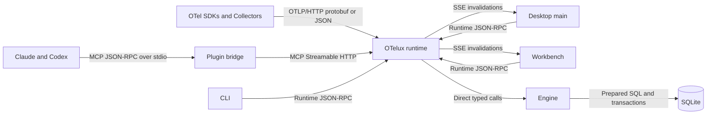

# OTelux Communication And Wire Contracts

Updated: 2026-07-16

OTelux has one local runtime and several clients. Each boundary uses one protocol chosen for that boundary; transports must not leak storage details or create parallel domain models.

## Principles

1. Use ecosystem standards at external boundaries: OTLP for telemetry and MCP for agent tools.
2. Use direct typed calls inside one process. Do not serialize just to preserve an artificial service boundary.
3. Use one OTelux-owned runtime RPC contract for Desktop, CLI, and the browser workbench.
4. Keep request/response traffic separate from one-way live invalidations.
5. Define wire types independently from TypeScript runtime types. JavaScript `bigint` is never placed directly in JSON.
6. Every collection is bounded, paginated, or windowed. No wire method returns an unbounded trace-log set or every point for every metric instrument.
7. A contract change is complete only when its TypeScript type, machine-readable schema snapshot, codecs, compatibility tests, and documentation agree.

## Channel Matrix



| Caller -> callee | Purpose | Transport | Envelope / encoding | Contract owner | Status |
|---|---|---|---|---|---|
| OTel SDK or Collector -> runtime | Ingest traces, logs, metrics | Loopback HTTP | OTLP/HTTP protobuf or OTLP JSON | OpenTelemetry OTLP schemas | Live |
| Runtime -> engine/storage | Ingest and query | Direct TypeScript calls | In-memory domain objects | `@otelux/types`, `@otelux/protocol` | Live |
| Engine -> SQLite | Persistence and indexed query | `node:sqlite` API | Prepared SQL statements and transactions | `@otelux/engine-node` schema version | Live |
| Electron renderer -> Electron main | Temporary Desktop query/control bridge | Electron `ipcRenderer.invoke` plus push channel | Structured-clone `InvokeMessage`, typed result, `RuntimeEvent` | Desktop IPC module re-exporting `@otelux/protocol` | Live until daemon client conversion |
| Claude/Codex -> plugin bridge | Agent tool protocol | stdio | One MCP JSON-RPC 2.0 message per line | MCP specification plus OTelux tool schemas | Live |
| Plugin bridge -> runtime MCP | Agent tool forwarding | Loopback HTTP | MCP Streamable HTTP JSON-RPC 2.0, bearer token | MCP specification plus `@otelux/mcp-server` | Live |
| Client -> runtime discovery | Find active owner/endpoints | Owner-only files | Versioned `runtime.json` and `runtime.lock` JSON | `@otelux/local-runtime` | Live |
| Desktop main, CLI, browser -> daemon | OTelux query and control | Loopback HTTP | JSON-RPC 2.0 at `/api/v1/rpc` | Planned `@otelux/protocol` wire contract | Target |
| Runtime -> Desktop/browser | Live invalidations | Server-Sent Events | SSE at `/api/v1/events` with versioned JSON data | Planned `@otelux/protocol` event contract | Target |
| Browser -> runtime | Workbench assets | Same-origin HTTP GET | HTML, CSS, JavaScript | Built `@otelux/ui` assets | Target |

## Transport Decisions

### OTLP stays OTLP

The ingest listener accepts the standard `/v1/traces`, `/v1/logs`, and `/v1/metrics` OTLP/HTTP routes. Protobuf is the preferred encoding; JSON remains useful for fixtures and manual diagnostics. OTLP/gRPC can be added for exporter compatibility, but it must terminate at the receiver and must not become OTelux's internal query protocol.

### MCP stays agent-only

MCP is the public model-facing tool surface. It is not the UI API: agent tools return summaries optimized for model context, not stable paged workbench records. The plugin's stdio bridge may forward MCP to the runtime's authenticated Streamable HTTP endpoint without translating it into another RPC dialect.

### Runtime RPC uses JSON-RPC 2.0 over HTTP

Desktop main, CLI, and the browser adapter need the same typed commands and query operations. JSON-RPC provides request IDs, standard errors, method names, and batchability without inventing one REST endpoint per operation.

Target endpoint:

```text
POST http://127.0.0.1:<api-port>/api/v1/rpc
Content-Type: application/json
Authorization: Bearer <runtime-control-token>
```

Static identity and health checks remain ordinary `GET` routes. The Runtime RPC endpoint is separate from MCP, even if both dispatch into the same engine.

### Live updates use SSE, not WebSocket

Current live traffic is server-to-client invalidation only. Clients refetch a bounded query after a signal changes. SSE is browser-native, reconnectable, inspectable, and simpler to secure than a bidirectional WebSocket. WebSocket becomes justified only if a real low-latency bidirectional workflow appears; it is not required for telemetry invalidations.

Events are hints, not an authoritative data stream. Delivery is at-least-once and may be coalesced. After reconnect or a revision gap, a client refetches its active queries.

### No internal gRPC

Internal gRPC would require browser translation, generated clients, HTTP/2 lifecycle work, and a second error/version model. It offers no advantage for the current local request/response plus one-way-event shape. OTLP/gRPC support is independent and does not change this decision.

## Runtime RPC Schema

The first request from a client is `runtime/initialize`:

```json
{
  "jsonrpc": "2.0",
  "id": "1",
  "method": "runtime/initialize",
  "params": {
    "protocolVersion": "1.0",
    "client": { "name": "otelux-desktop", "version": "0.1.0" }
  }
}
```

A successful response returns the negotiated version, runtime identity, capabilities, and limits. An unsupported major version returns JSON-RPC error `-32001` with supported versions in `error.data`.

Required method families:

| Method | Request | Result | Bound |
|---|---|---|---|
| `runtime/getStatus` | empty | endpoints, versions, storage path, listener states | one object |
| `runtime/getSettings` | empty | `Settings` | one object |
| `runtime/updateSettings` | `PartialSettings` | `UpdateSettingsResult` | one object |
| `runtime/loadSampleData` | empty | signal counts | fixed |
| `runtime/clearData` | confirmation token | empty | fixed |
| `telemetry/listTraces` | cursor query | trace summary page | max 200 rows |
| `telemetry/getTrace` | `traceId`, expansion flags | one trace and spans; optional bounded logs | one trace, explicit log limit |
| `telemetry/getSpan` | `traceId`, `spanId` | one span | one span |
| `telemetry/listLogs` | cursor query | log page | max 500 rows |
| `telemetry/listMetricInstruments` | cursor query | instrument metadata page, no point history | max 500 rows |
| `telemetry/getMetricPoints` | instrument ID, time window, cursor | one bounded point page | max 2,000 points |
| `telemetry/getFacets` | signal/time/filter scope | service, scope, meter, severity counts | bounded grouped values |

Methods must use one canonical registry that generates or validates Desktop/CLI/browser adapters. MCP tools call engine query services directly and may compose several methods, but they do not redefine the underlying query semantics.

### Error envelope

Runtime methods use JSON-RPC errors consistently:

| Code | Meaning |
|---:|---|
| `-32600` | Invalid request envelope |
| `-32601` | Unknown method |
| `-32602` | Invalid params or schema violation |
| `-32603` | Unexpected internal error; details excluded by default |
| `-32001` | Unsupported protocol version |
| `-32002` | Runtime not ready or shutting down |
| `-32003` | Cursor expired or invalid |
| `-32004` | Conflict, including competing mutation or migration state |

Validation failures include a stable machine-readable path/code in `error.data`, not stack traces or SQL text.

## Wire Value Encoding

Domain types use `bigint` for nanoseconds and OTLP int64 attributes. JSON does not.

Wire rules:

- Trace IDs are lowercase 32-character hexadecimal strings.
- Span IDs are lowercase 16-character hexadecimal strings and are always paired with `traceId` when identifying a span.
- Nanosecond timestamps and durations are base-10 strings matching `^-?[0-9]+$`.
- Ordinary finite metric values remain JSON numbers.
- Non-finite numbers are rejected at the contract boundary.
- Attribute `bigint` values use the tagged representation `{ "$bigint": "123" }`; arrays apply the same rule element-wise.
- Optional fields are omitted. `null` is used only when null has a distinct domain meaning.
- Unknown object fields are ignored within a compatible major version; unknown discriminators fail validation.

The tagged bigint representation matches the durable-store codec and preserves the distinction between an OTLP string and OTLP int64 value.

## SSE Event Contract

Example:

```text
id: 1042
event: telemetry.changed
data: {"schemaVersion":1,"revision":"1042","signals":["traces","logs"],"traceIds":["0123456789abcdef0123456789abcdef"]}
```

Rules:

- `revision` is a monotonic decimal string for one runtime process.
- `signals` is a non-empty set of `traces`, `logs`, `metrics`, `settings`, or `status`.
- Identifiers are optional hints and may be omitted when a batch is large.
- Events carry no full telemetry records and no secrets.
- The runtime may coalesce adjacent events.
- Clients debounce and refetch active bounded queries.
- A reconnect with an unknown/expired `Last-Event-ID` receives `runtime.resync`, causing a full active-query refresh.

## Authentication And Browser Safety

- MCP keeps its read-only token and tool annotations.
- Runtime RPC uses a separate owner-only control token with explicit read/control scopes; the token value is never written into `runtime.json`.
- Desktop renderer never receives a filesystem token. Electron main proxies RPC or establishes a scoped session.
- The workbench is served by the runtime on the same origin as its API. `otelux open` exchanges a one-time nonce for a `Secure`-where-applicable, `HttpOnly`, `SameSite=Strict` session cookie and immediately redirects to a clean URL.
- Every HTTP listener validates `Host` and `Origin`, sends no permissive CORS wildcard, bounds bodies, and refuses browser requests on OTLP/MCP unless explicitly allowed.
- Mutating runtime methods require control scope and CSRF protection in browser sessions.

## Contract Artifacts And Tests

Before the daemon API is considered stable:

1. Split domain types from wire DTOs in `@otelux/protocol`.
2. Add explicit `encodeWire` / `decodeWire` codecs with bigint and malformed-input tests.
3. Generate checked-in JSON Schema draft 2020-12 snapshots under `packages/protocol/schema/v1/` for Runtime RPC params/results, events, and `runtime.json`. Every schema has a stable `$id` under `https://otelux.dev/schema/v1/` and forbids accidental undeclared fields where forward compatibility does not require them.
4. Add schema compatibility tests: old fixture -> new decoder, new compatible fields -> old decoder behavior, unsupported major -> deterministic error.
5. Add transport conformance tests that run the same method suite through direct calls, Electron IPC during transition, and HTTP RPC.
6. Add payload-size and pagination-limit tests.

## Current Gaps

- `@otelux/protocol` currently describes in-memory TypeScript values, not JSON wire DTOs.
- Electron IPC and runtime events have compile-time types but no runtime validation.
- MCP tool input schemas are advertised but handlers cast inputs rather than validating them.
- MCP tool results are JSON inside one text content block and have no output schemas.
- `runtime.json` has a TypeScript reader but no checked-in JSON Schema.
- List APIs use offsets; the daemon contract should use opaque keyset cursors to avoid page drift during live ingest.

These gaps must be addressed before Desktop becomes a daemon client or the plugin is published as self-contained.
